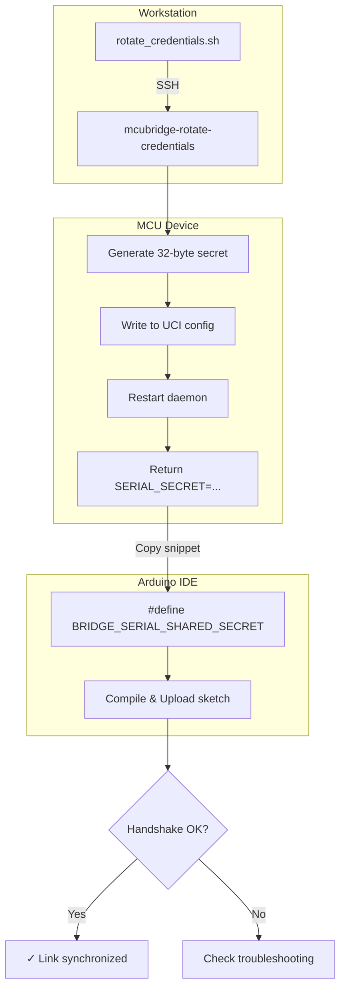

# McuBridge Credential Rotation

Secure deployments require the MCU, the Linux daemon, and the MQTT broker to agree on the same shared materials. This guide explains how to regenerate those secrets with the provided tooling and how to keep the Arduino firmware synchronized without leaking credentials into version control.

## Rotation Flow Overview



## When to rotate

- **Before shipping a device**: The repository ships with placeholder secrets so the bridge works immediately after flashing. Rotate them before exposing the hardware outside of a lab network.
- **After servicing hardware**: Any time the MCU or daemon image is reflashed on an untrusted bench.
- **On a schedule**: Align with your org’s security cadence (e.g., every 90 days) so MQTT credentials and serial secrets do not become stale.

## Quick rotation from your workstation

```sh
# Rotate credentials on a remote MCU and print the sketch snippet.
./tools/rotate_credentials.sh --host <mcu-ip>
```

What happens:

1. The script connects via SSH (default user `root`) and runs `/usr/bin/mcubridge-rotate-credentials` on the device.
2. The helper writes the regenerated secrets to UCI (`/etc/config/mcubridge`) and restarts the daemon.
3. The script captures the freshly generated serial shared secret (stored in `mcubridge.general.serial_shared_secret`, also printed as `SERIAL_SECRET=...`) and prints a ready-to-paste snippet:

   ```c
   #define BRIDGE_SERIAL_SHARED_SECRET "<hex-secret>"
   ```

   Drop that line near the top of every sketch (before `#include <Bridge.h>`).
4. Optional: pass `--emit-sketch-snippet path/to/secret.h` if you prefer the helper to write the snippet to a header that you `#include` from your sketch sources.

### Rotating without SSH

You can run the same helper locally to update bootstrap images or CI artifacts by pointing `--local` to the UCI config directory inside your rootfs (for example, `build_dir/root-ath79/etc/config`):

```sh
sudo ./tools/rotate_credentials.sh --local build/rootfs/etc/config \
  --emit-sketch-snippet my_project/BridgeSecret.inc
```

The CLI sets `UCI_CONFIG_DIR` to the provided path, invokes `openwrt-mcu-core/scripts/mcubridge-rotate-credentials`, and (optionally) drops a snippet file that you can include from multiple sketches.

## LuCI workflow

The **Services → McuBridge → Credentials & TLS** page now shows an "Arduino Secret Template" block once the rotation succeeds. Use the **Copy snippet** button to paste the synchronized `BRIDGE_SERIAL_SHARED_SECRET` line directly into your sketch (before `#include <Bridge.h>`) or into a local header that you manage inside your project.

## Verifying the new material

1. Rebuild or re-upload your Arduino sketch so it includes the updated `#define BRIDGE_SERIAL_SHARED_SECRET "..."` line (or the header where you stored that snippet).
2. Run `tools/hardware_smoke_test.sh --host <mcu>` or use the LuCI "Run smoke test" button to confirm Linux ↔ MCU communication still succeeds.
3. Check daemon logs via `logread | grep mcubridge` or the LuCI status panel for `handshake` entries. Any `serial handshake rejected` messages typically mean the MCU firmware did not pick up the new header yet.

## Operational checklist

- Track which devices have been rotated by tagging them in your asset inventory or by storing the `SERIAL_SECRET=...` line that `tools/rotate_credentials.sh` prints during automation runs.
- If you mirror secrets into another system (e.g., provisioning service), parse the `SERIAL_SECRET=...` line that the CLI prints or call the LuCI endpoint (`/admin/services/mcubridge/rotate_credentials`) and use the `serial_secret` field in its JSON response.
- Keep any snippet/header file with `BRIDGE_SERIAL_SHARED_SECRET` out of version control (or encrypt it) so each device preserves its unique material.
- Store TLS assets separately from the credential file. If you use mutual TLS (mTLS), manage client certificates explicitly and keep them out of version control.

Following this workflow keeps the MCU and daemon secrets aligned and makes rotations a repeatable, scriptable process that you can embed in CI, provisioning scripts, or LuCI itself.

## Troubleshooting

### Common HMAC / Handshake Errors

| Symptom | Likely Cause | Resolution |
|---------|--------------|------------|
| `serial handshake rejected` | MCU secret differs from daemon | Re-upload sketch with correct `BRIDGE_SERIAL_SHARED_SECRET` |
| `HMAC verification failed` | Secret mismatch or corrupted frame | Verify hex string has no typos; check serial baud rate (115200) |
| `Handshake timeout` | MCU not responding | Confirm MCU is powered and serial link connected |
| `Anti-replay: nonce reused` | MCU reset without daemon restart | Restart daemon: `service mcubridge restart` |
| `Key derivation error` | Invalid secret length | Ensure secret is exactly 64 hex chars (32 bytes) |

### Manual Verification with MQTT

After rotation, verify end-to-end connectivity using `mosquitto_pub` and `mosquitto_sub`:

```sh
# Terminal 1: Subscribe to status topic
mosquitto_sub -h 127.0.0.1 -p 8883 \
  --cafile /etc/mcubridge/ca.crt \
  -t 'br/system/status' -v

# Terminal 2: Request system info (triggers MCU response)
mosquitto_pub -h 127.0.0.1 -p 8883 \
  --cafile /etc/mcubridge/ca.crt \
  -t 'br/system/info' -m ''
```

Expected output on Terminal 1:
```json
br/system/status {"synchronised":true,"mcu_version":{"major":1,"minor":0},...}
```

If `synchronised` is `false`, the handshake failed—check the errors above.

### Log Analysis

```sh
# Real-time daemon logs (filter handshake events)
logread -f | grep -E 'mcubridge.*(handshake|HMAC|nonce)'

# Last 50 handshake-related entries
logread | grep mcubridge | grep -i handshake | tail -50
```

Key log fields to inspect:
- `handshake_state`: Should progress `IDLE → CHALLENGE_SENT → SYNCHRONIZED`
- `hmac_valid`: Must be `true` for successful authentication
- `nonce_counter`: Should increment monotonically (anti-replay protection)

