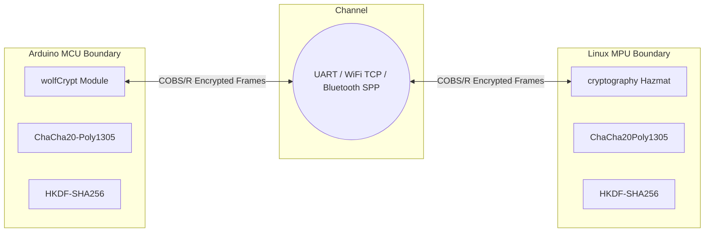

# FIPS 140-3 Security Policy: Arduino MCU Bridge 2

**Standard Compliance:** FIPS 140-3 (Level 1/2), NIST SP 800-38D, NIST SP 800-56C Rev 2, RFC 8439  
**Module Name:** Arduino MCU Bridge 2 Cryptographic Subsystem  
**Software Version:** v2.8.5+  

---

## 1. Cryptographic Boundary & Ports

The cryptographic module boundary encompasses the mutual handshake, session key derivation, and authenticated encryption layers connecting the Arduino MCU (C++ / wolfCrypt) and the Linux MPU (Python / `cryptography`).

---

## 2. Roles, Services, and Authentication

### 2.1 Supported Roles
1. **User Role**: Standard operational role capable of issuing RPC calls (I/O, Mailbox, DataStore, Console, FileSystem, SPI) over the authenticated channel.
2. **Crypto Officer Role**: Responsible for configuring pre-shared keys (`serial_shared_secret` via UCI) and triggering credential rotation (`mcubridge-rotate-credentials`).

### 2.2 Critical Security Parameters (CSPs)
* **Master Pre-Shared Key ($K_{master}$)**: 256-bit secret stored in UCI `/etc/config/mcubridge` (MPU) and compiled/provisioned in Arduino sketch (MCU).
* **Ephemeral Session Key ($K_{session}$)**: 256-bit symmetric key derived dynamically per session using HKDF-SHA256.
* **Monotonic Nonce Counter ($N_{seq}$)**: 64-bit strictly increasing anti-replay counter.

---

## 3. Cryptographic Algorithms & Self-Tests (KATs)

### 3.1 Approved Algorithms

| Algorithm | Standard | Key Size | Purpose |
| :--- | :--- | :--- | :--- |
| **ChaCha20-Poly1305** | RFC 8439 / SP 800-38D equiv. | 256-bit | Authenticated Encryption with Associated Data (AEAD) |
| **HKDF-SHA256** | RFC 5869 / SP 800-56C Rev 2 | 256-bit | Key Derivation Function (KDF) |
| **HMAC-SHA256** | FIPS 198-1 / FIPS 180-4 | 256-bit | Handshake Mutual Verification Tag |
| **SHA-256** | FIPS 180-4 | 256-bit | Cryptographic Hashing |

### 3.2 Power-Up Known-Answer Tests (KATs)
Before entering any operational state, both endpoints independently execute Power-On Self-Tests:
1. **SHA-256 KAT**: Standard NIST test vector verifying digest generation.
2. **HMAC-SHA256 KAT**: Hardcoded verification tag calculation against RFC 2202 test vectors.
3. **ChaCha20-Poly1305 KAT**: RFC 8439 Section 2.8.2 standard test vector with AAD, validating ciphertext encryption and Poly1305 authentication tag calculation.
4. **Failure Behavior**: If any KAT returns an invalid result, the cryptographic engine enters a hard `FAULT` state and refuses all cryptographic operations.

---

## 4. Key Management & Zeroization

### 4.1 Ephemeral Key Derivation
Session keys are derived via HKDF-SHA256 over a fresh 16-byte cryptographically secure random nonce exchanged during handshake:
$$K_{session} = \text{HKDF-Expand}(\text{HKDF-Extract}(Salt, K_{master}), \text{"McuBridgeSessionKey-v2"}, 32)$$

### 4.2 Anti-Replay Nonce Layout
Every encrypted frame carries a 12-byte nonce:
$$\text{Nonce} = \underbrace{\text{Prefix}}_{\text{3 bytes: "MCU"/"MPU"}} \parallel \underbrace{\text{0x00}}_{\text{1 byte pad}} \parallel \underbrace{\text{Counter}}_{\text{8 bytes: strictly monotonic}}$$
Frames with nonces $\le$ `last_seen_counter` are immediately discarded as replay attempts.

### 4.3 Key Zeroization (*Safe Memory Scrubbing*)
* **C++ MCU**: Memory containing $K_{session}$ and intermediate buffers is zeroized using `wc_ForceZero()` to defeat compiler dead-store elimination.
* **Python MPU**: Secure zeroization performed via two-pass `ctypes.memset()` overriding underlying memory buffers.

### 4.4 TLS 1.3 0-RTT Session Ticket Management (Cloud Gateway)
* **Storage**: Ephemeral session tickets for fast gRPC 0-RTT re-handshakes are cached in LMDB (`RuntimeState.tls_session_cache`) with process-level access permissions.
* **Lifecycle & Anti-Replay**: Session tickets have strict time-to-live bounds and single-use resumption policies, preventing TLS 1.3 early-data replay attacks.
